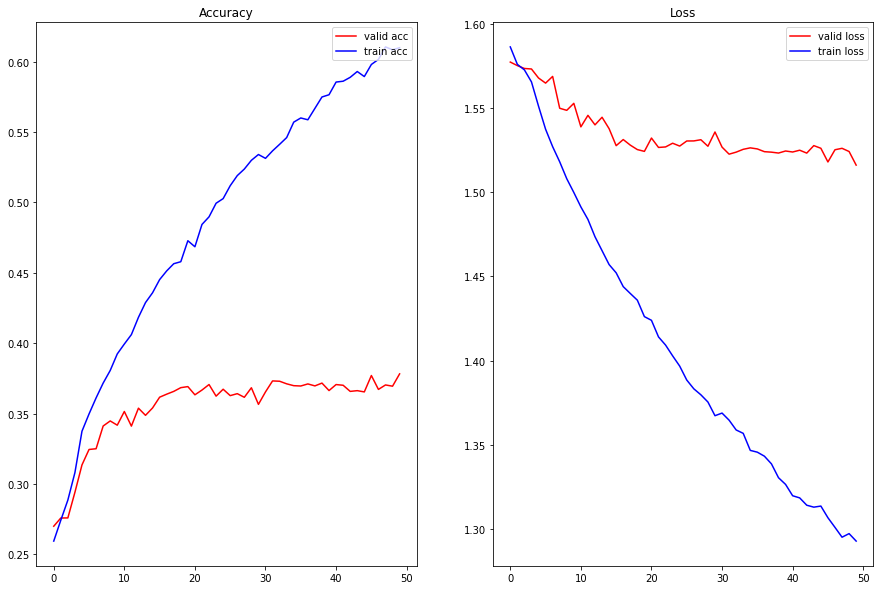

# SST Classification

## Data - Stanford Sentiment Analysis TreeBank

Boring details about the original data:

1. original_rt_snippets.txt: 10,605 processed snippets from the original pool of Rotten Tomatoes HTML files. Some snippet contain multiple sentences.
2. dictionary.txt contains all phrases and their IDs, separated by a vertical line
3. sentiment_labels.txt contains all phrase ids and the corresponding sentiment labels, separated by a vertical line. Note that you can recover the 5 classes by mapping the positivity probability using the following cut-offs: [0, 0.2], (0.2, 0.4], (0.4, 0.6], (0.6, 0.8], (0.8, 1.0] for very negative, negative, neutral, positive, very positive, respectively. Please note that phrase ids and sentence ids are not the same.
4. SOStr.txt and STree.txt encode the structure of the parse trees. STree encodes the trees in a parent pointer format. Each line corresponds to each sentence in the datasetSentences.txt file. The Matlab code of this paper will show you how to read this format if you are not familiar with it.
5. datasetSentences.txt contains the sentence index, followed by the sentence string separated by a tab. These are the sentences of the train/dev/test sets.
6. datasetSplit.txt contains the sentence index (corresponding to the index in datasetSentences.txt file) followed by the set label separated by a comma: 1 = train 2 = test 3 = dev

Please note that the datasetSentences.txt file has more sentences/lines than the original_rt_snippet.txt. Each row in the latter represents a snippet as shown on RT, whereas the former is each sub sentence as determined by the Stanford parser.

### Data Preparation 
For this assignments we have to work with 3 datasets:

1. `datasetSentences.txt` : just containing the sentences(subset of phrases in `Dictionary.text`)
2. `Dictionary.text` : a mapping of a lot of sentences(called phrasesand their `phrase ids`)
3. `sentiment_labels.txt` has sentiment values for `phrase ids`

Basically Labels are actually mapped to the Phrases and not directly to sentences; we will need to map labels to sentences but first getting phrase ids for each sentences.

Combining `datasetSentences.txt` and `dictionary.txt` will give `phrase id`'s for the sentence data; let's call it: `sent_phrase_df`

Merging `sent_phrase_df` with `sentiment_label.txt` will give us sentiment values for each sentence. : `final_df`

**Steps to follow**
* Step1 : Get phrase ids for each sentence by inner join: {`sent_df` and `dictionary`} | Call: `sent_phrase_df`
* Step2 : Get sentiment values for each sentence based on phrase ids by left join: {`sent_phrase_df` and `sentiment_labels`}
* Step3 : Convert floating-point `sentiment values` into 5 classes (0-0.2, 0.2-0.4, 0.4-0.6, 0.6-0.8, 0.8-1.0); `pd.cut()` works just fine.

## Model Architecture

```
classifier(
  (embedding): Embedding(16406, 256)
  (encoder): LSTM(256, 128, num_layers=2, batch_first=True, dropout=0.4, bidirectional=True)
  (fc): Linear(in_features=128, out_features=5, bias=True)
)
The model has 4,991,109 trainable parameters
```

## Training Logs
```
	Epoch: 40 | Train Loss: 1.320 | Train Acc: 58.56%
	 Val. Loss: 1.524 |  Val. Acc: 37.06% 

	Epoch: 41 | Train Loss: 1.318 | Train Acc: 58.62%
	 Val. Loss: 1.525 |  Val. Acc: 37.01% 

	Epoch: 42 | Train Loss: 1.314 | Train Acc: 58.89%
	 Val. Loss: 1.523 |  Val. Acc: 36.57% 

	Epoch: 43 | Train Loss: 1.313 | Train Acc: 59.31%
	 Val. Loss: 1.528 |  Val. Acc: 36.63% 

	Epoch: 44 | Train Loss: 1.314 | Train Acc: 58.95%
	 Val. Loss: 1.526 |  Val. Acc: 36.54% 

	Epoch: 45 | Train Loss: 1.307 | Train Acc: 59.81%
	 Val. Loss: 1.518 |  Val. Acc: 37.70% 

	Epoch: 46 | Train Loss: 1.301 | Train Acc: 60.17%
	 Val. Loss: 1.525 |  Val. Acc: 36.72% 

	Epoch: 47 | Train Loss: 1.295 | Train Acc: 61.06%
	 Val. Loss: 1.526 |  Val. Acc: 37.03% 

	Epoch: 48 | Train Loss: 1.297 | Train Acc: 60.85%
	 Val. Loss: 1.524 |  Val. Acc: 36.94% 

	Epoch: 49 | Train Loss: 1.293 | Train Acc: 61.00%
	 Val. Loss: 1.516 |  Val. Acc: 37.82% 
```

## Training Graphs


## Prediction of 10 samples from the test dataset
```
Sentence :  The pleasures that it does afford may be enough to keep many moviegoers occupied amidst some of the more serious - minded concerns of other year - end movies .
Predicted : neutral
Target : positive

Sentence :  The power of this script , and the performances that come with it , is that the whole damned thing did n't get our moral hackles up .
Predicted : very negative
Target : neutral

Sentence :  The isolated moments of creative insanity finally are lost in the thin soup of canned humor .
Predicted : very negative
Target : neutral

Sentence :  Poetry in motion captured on film .
Predicted : positive
Target : very positive

Sentence :  I like the new footage and still love the old stuff .
Predicted : very negative
Target : very positive

Sentence :  Nemesis suffers from a paunchy midsection , several plodding action sequences and a wickedly undramatic central theme .
Predicted : negative
Target : negative

Sentence :  Few of the increasingly far - fetched events that first - time writer - director Neil Burger follows up with are terribly convincing , which is a pity , considering Barry 's terrific performance .
Predicted : very negative
Target : neutral

Sentence :  Though few will argue that it ranks with the best of Herzog 's works , Invincible shows he 's back in form , with an astoundingly rich film .
Predicted : very negative
Target : very positive

Sentence :  Even if it ultimately disappoints , the picture does have about a matinee admission 's worth of funny to keep it afloat .
Predicted : very negative
Target : neutral

Sentence :  A marvel like none you ' ve seen .
Predicted : negative
Target : positive
```
